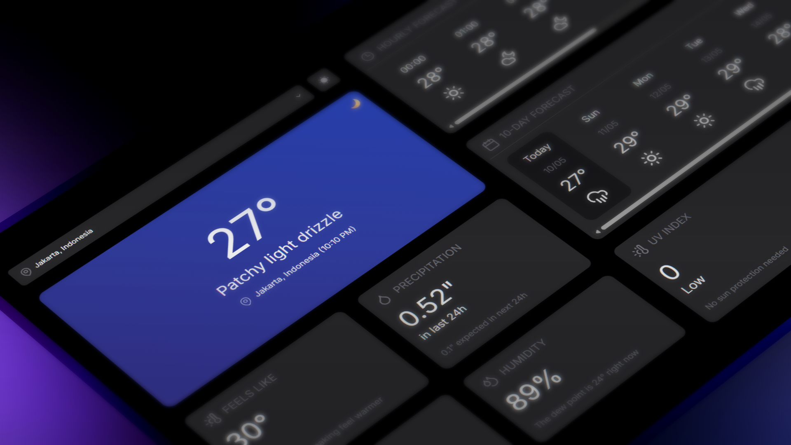
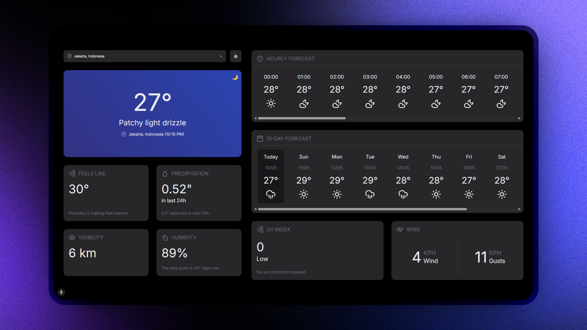

# Sky Watch

Sky Watch adalah aplikasi cuaca sederhana dan modern yang dibangun dengan **Next.js 15**. Aplikasi ini memungkinkan pengguna mencari kondisi cuaca secara real-time untuk berbagai lokasi, lengkap dengan prediksi cuaca hingga 10 hari. Dengan desain responsif dan smooth animation, Sky Watch memberikan pengalaman pengguna yang menarik dan informatif.

## ✨ Fitur Utama

- Pencarian lokasi dengan autocomplete
- Informasi cuaca saat ini dan prediksi hingga 10 hari
- Tampilan mode gelap (dark mode)
- Komponen modular untuk mempermudah pengembangan
- Animasi transisi yang halus dengan Framer Motion

## 🚀 Technologies Used

- [Next.js 15](https://nextjs.org/docs/getting-started)
- [HeroUI v2](https://heroui.com/)
- [Tailwind CSS](https://tailwindcss.com/)
- [Tailwind Variants](https://tailwind-variants.org)
- [TypeScript](https://www.typescriptlang.org/)
- [Framer Motion](https://www.framer.com/motion/)
- [next-themes](https://github.com/pacocoursey/next-themes)

## 📸 Mockups

Berikut beberapa tampilan dari Sky Watch:





## 💻 Instalasi

```bash
# Clone repositori
git clone https://github.com/username/skywatch.git

# Masuk ke folder proyek
cd skywatch

# Install dependencies
npm install

# Jalankan project
npm run dev
```
